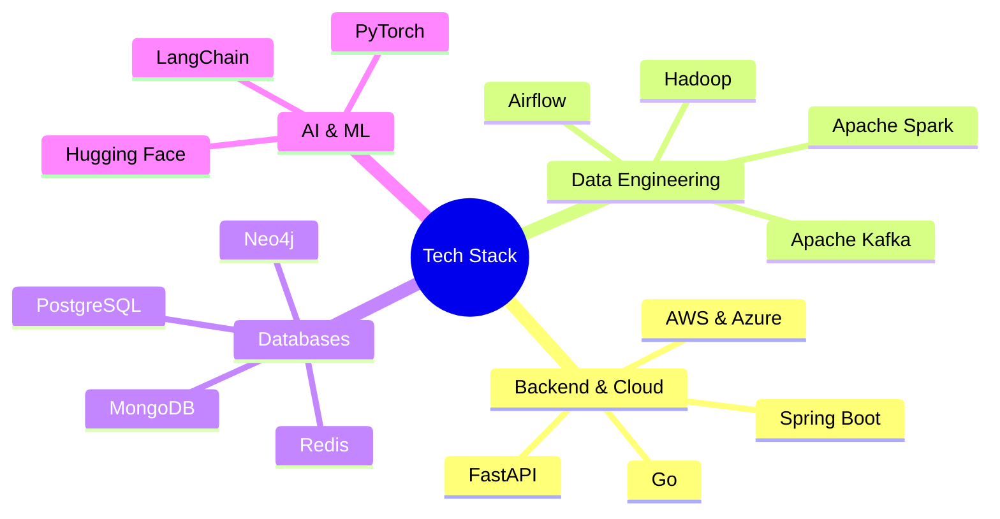

# Hi there, I'm Arijit 👋 

I am an Associate Software Engineer at **Maersk**, where I specialize in building highly scalable, fault-tolerant backend architectures and intelligent automation systems. 

### 🏗️ Technical Domain & Expertise

*(Proficient across C/C++, Python, Java, Go, and SQL)*

### 🚀 Professional Highlights
* Spearheaded a database migration from NoSQL to PostgreSQL to resolve tool incompatibilities and optimize costs.
* Orchestrated a system re-architecture using multi-level Redis caching, achieving a 97.5% reduction in response time (from 20s to 500ms) and cutting server load by over 60%.
* Engineered a fault-tolerant Apache Kafka architecture that guarantees 100% data integrity during downtimes.
* Pioneered a RAG-based Generative AI automation suite for asset discovery and an intelligent incident response bot.

### 🔭 Projects & Research
* **Database Optimization:** Currently executing a high-performance architecture that merges B-trees with object stores to drastically optimize database read and write speeds.
* **ModifiNet Deep Learning:** Architected a custom 50-layer CNN model inspired by ResNet, achieving 75.29% accuracy on the CIFAR-100 dataset.
* **BUSZ UP:** Developed a decentralized blockchain-enabled BI platform for business expansion analysis, winning the MLH Hackathon 5IRE Track.

---

### ⛰️ Beyond the Screen
To put it simply: **I am boringly interesting.** I thrive on extreme consistency in both the terminal and the physical world
